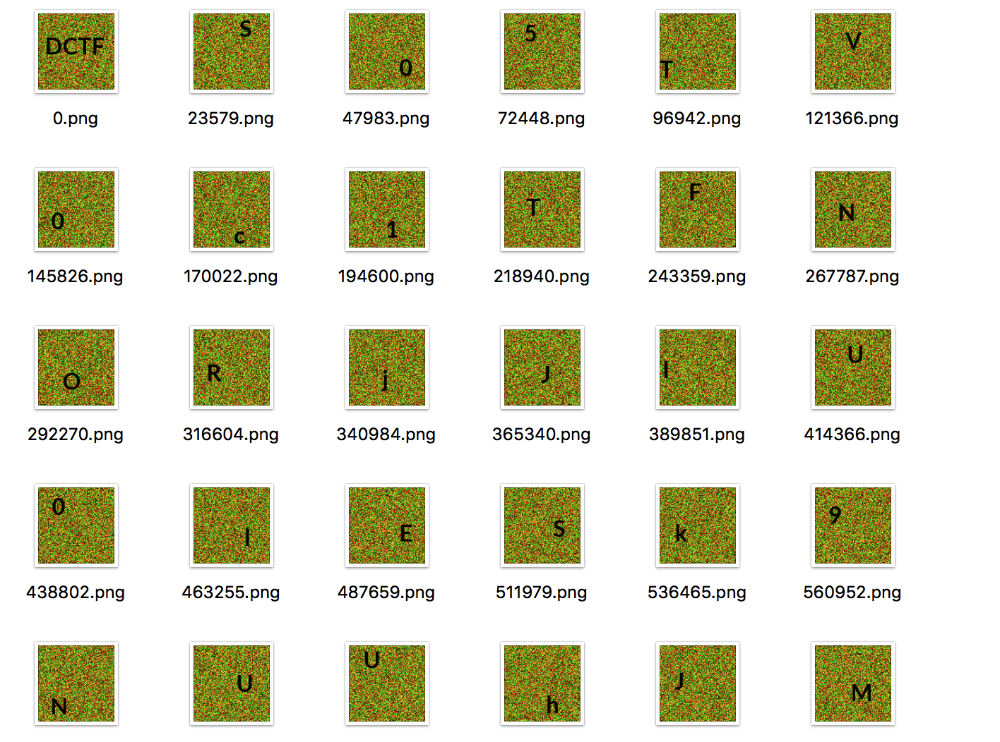

# DefCamp CTF Finals 2016 - WildImage
### Misc - 150 pts

[Challenge (29.7Mo)](WildImage.png)

This challenge is about this image. Once we download it, we see that it is very large (about 30Mo). The first thing we can think about is that it contains other data than this simple image.

First idea was to run binwalk on this image. We use this command `binwalk -rMe -D 'png image:png' WildImage.png` but it creates a lot of data and false positives. And apart from the false positives, images  I didn't really understood the problem here but seems like binwalks don't stop where it should when extracting. Once we do this we get about 18Go of data... Really too much ! :)

So the idea was to use binwalk data adress detection and cut it ourselves. I used this little bash script created by someone else of the team :
```bash
binwalk WildImage.png | grep PNG >ap; ls -l WildImage.png | cut -f7 -d' ' >> ap
mkdir images;org=0; for i in $(cut -f1 -d' ' ap ); do dd if=WildImage.png of=images/$org.png bs=1 skip=$org count=$(($i - $org)); org=$i; done
```

We use binwalk on WildImage and grep PNG files to the `ap` address file. We append the total filesize at the end to allow or script to fetch the last image.

Once done, we get 1217 images. If you want the solution directly, jump to the next subpart. I will first explain the ideas we had before getting the solution.

## First idea : What about keeping only hexadecimal characters ?

The first image was "DCTF". So I thought the flag was directly written. The first idea was to keep only the hexadecimal characters in all these images. So I ran this code

```python
from PIL import Image
import pytesseract
from os import listdir
from os.path import isfile, join

mypath = "./images"
onlyfiles = [join(mypath,f) for f in listdir(mypath) if isfile(join(mypath, f)) and f.split('.')[-1] == 'png']
string = ""
for f in onlyfiles[1:]: #Avoiding openning the "DCTF" one
	im = Image.open(f)
	newIm = Image.new('RGB',im.size,"white")
	pixels = im.load()
	newPixels = newIm.load()
	for i in range (0,im.size[0]):
		for j in range(0,im.size[1]):
			if pixels[i,j] == (0,0,0):
				newPixels[i,j] = pixels[i,j] #remove background pixels to help tesseract do his work

	captchaRep = pytesseract.image_to_string(newIm,config="-psm 10")
	if captchaRep in "abcdef0123456789":
		newIm.save('hexa/'+f.split('/')[-1])
```

and got some false positives on the `l` letter which, I think, tesseract took for the number `1`. There were much more characters than a classic md5. So I thought : Well, all images are 100x100 pixels, let's try to fuse all images, maybe some will go to the same place and we'll get a little text. But nevermind, this was awfull.

## Second part : The real solution

Well, stop doing strange things, let's get back to the solution :D


As we can easily see, all images are in the base64 charset. Let's write all images and try to base64 decode !

We did it by hand, because pytesseract had problems with few letters and it seemed quite fast and more reliable. So we ended up with this text :
```
S05TV0c1TFNoRjJIU0lESk9NUUhJMkRGRUJTR0taM1NNVlNTQTMzR0VCWkdLNDNKT04yR0MzVERNVVFISTNaTUVCWFhFSURRT0pYWElaTERPUlVXNjNSQU1aWkc2M0pNRUJVR0M0VE5GWVFFUzVCQU1GWUhBM0RKTVZaU0E1RFBFQlFXNDZKQU9aMldzM1RGT0pRV0UzREZFQlFXNFpCQU9aUVdZNUxCTUpxR0tJREJPTUpXSzVCTUVCWlhLWTNJRUJRWEdJREJFQllHSzRUVE41WENZSURFTzVTV1kzREpoWlRTWUlERE41V1cyNUxpTkYySFNMQkFORjJHSzNKTUVCWEdDNURKTjVYQ1lJRFBPSVFHNjRUSE1GWEdTNlRCT1JVVzYzUk9CSkFYR0lET041MkdLWkJBTUo0U0E1RElNVVFFUzNUVE9SVVhJNUxvTVVRR00zM1NFQkpXS1kzVk9KVVhJNkpBTUZYR0lJQ1BPQlNXNElDTk1WMkdRMzNFTjVXRzZaM0pNVlpTQUtDSktOQ1VHVDJORkVRR1MzUkFPUlVHS0lDUEtOSlZJVEtORUFaU1lJRFRNVlJYSzRUSk9SNFNBNERTTjUzR1NaREZPTVFDRVlKQU1aWFhFM0pBTjVUQ0E0RFNONTJHS1kzVU5GWFc0SURYTkJTWEVaSkFNRVFlR1pMUU1GWkdDNURKTjVYQ0EyTFRFQlJYRVpMQk9SU1dJSURDTVYySE9aTEZOWVFlSTJERkVCUVhHNDNGT1JaU0FZTE9NUVFlSTJERkVCMkdRNFRGTUYyQzRJUkFLUlVHSzQzRkVCWldLNERCT0pRWEkyTFBOWlpTQVlMU01VUUdPWkxPTVZaR1NZM0JOUldlU0lERE1GV0dZWkxFRUFSR0czM09PUlpHNjNEVEZRUkNBWUxPTVFRSEczM05NVjJHUzNMRk9NUUdTM1RETllYV0laSkFNTlVHQzNUSE1WWlNBNURQRUlyR1FaSkFNRlpYR1pMVUVCWFhFSURVTkJTU0E1RElPSlNXQzVCT0VCTFdRWkxPRUJaV0tZM1ZPSlVYSTZKQU5WU1dLNURURUJYV0U0M0RPVlpHUzVEWkVCUVhJSUNFSU5LRU02M0dHUlJEUU9CU0dBM1dDTUJVTVZRV0NaQlhNUTRXS05KVEdZWkdDTlpVTVk0RE9OVEZHRjZTQU1SUUdFM0E9PT09
```

Having few errors would'nt really hurt as far as we don't miss a char.

Once base64 decoded, we end up with this text :
```
KNSWG5LShF2HSIDJOMQHI2DFEBSGKZ3SMVSSA33GEBZGK43JON2GC3TDMUQHI3ZMEBXXEIDQOJXXIZLDORUW63RAMZZG63JMEBUGC4TNFYQES5BAMFYHA3DJMVZSA5DPEBQW46JAOZ2Ws3TFOJQWE3DFEBQW4ZBAOZQWY5LBMJqGKIDBOMJWK5BMEBZXKY3IEBQXGIDBEBYGK4TTN5XCYIDEO5SWY3DJhZTSYIDDN5WW25LiNF2HSLBANF2GK3JMEBXGC5DJN5XCYIDPOIQG64THMFXGS6TBORUW63ROBJAXGIDON52GKZBAMJ4SA5DIMUQES3TTORUXI5LoMUQGM33SEBJWKY3VOJUXI6JAMFXGIICPOBSW4ICNMV2GQ33EN5WG6Z3JMVZSAKCJKNCUGT2NFEQGS3RAORUGKICPKNJVITKNEAZSYIDTMVRXK4TJOR4SA4DSN53GSZDFOMQCEYJAMZXXE3JAN5TCA4DSN52GKY3UNFXW4IDXNBSXEZJAMEQeGZLQMFZGC5DJN5XCA2LTEBRXEZLBORSWIIDCMV2HOZLFNYQeI2DFEBQXG43FORZSAYLOMQQeI2DFEB2GQ4TFMF2C4IRAKRUGK43FEBZWK4DBOJQXI2LPNZZSAYLSMUQGOZLOMVZGSY3BNRWeSIDDMFWGYZLEEARGG33OORZG63DTFQRCAYLOMQQHG33NMV2GS3LFOMQGS3TDNYXWIZJAMNUGC3THMVZSA5DPEIrGQZJAMFZXGZLUEBXXEIDUNBSSA5DIOJSWC5BOEBLWQZLOEBZWKY3VOJUXI6JANVSWK5DTEBXWE43DOVZGS5DZEBQXIICEINKEM63GGRRDQOBSGA3WCMBUMVQWCZBXMQ4WKNJTGYZGCNZUMY4DONTFGF6SAMRQGE3A====
```

The remarkable thing are the four `=` at the end which could be the signature of base32 padding. Also all chars seems in base32 charset. Let's try it out !

We obtain

```
Securty is the degree of resistance to, or protection from, harm. It applies to any vu`nerable and valuab@e aset, such as a person, dwellig, commu`ity, item, nation, or organization.
As noted by the Institu`e for Security and Open Methodologies (ISECOM) in the OSSTMM 3, security provides "a form of protection where a eparation is created between he assets and he threat." These separations are genericall	 called "controls," and sometimes incn/de changes to"he asset or the threat. When security meets obscurity at DCTF{f4b88207a04eaad7d9e5362a74f876e1} 2016
```
and there goes the flag !

Few errors are present in the final decryption due to some misstakes in the character recognition done by hand, because we wanted to do it quickly and it was easy to verify afterward.

