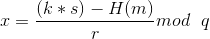

# GreHack 2017 - NEW DSA
### Crypto - 100 pts

    I think I did a major breakthrough in cryptography: I managed to implement the DSA algorithm without any need of a random source. After all, all we need is a nonce, right ?

    Don't you dare tell me it's insecure: I tested it! But if you think you're smarter than me, I dare you to sign sign_me with my key just knowing the signature of signed which is signature.

    Public key: public.pem Format expected for the signature (same as the file 'signature'): '(0000000, 0000000)'

    192.168.4.30:4100
    
This challenge is about signatures with DSA. The text is pretty straightforward, it doesn't use random sources, which is a mistake. Indeed, When generating a DSA signature, you need to use your private key and a *cryptographically secure random* number (usually called `k`). If this number is not random and can be found, we can then retrieve the private key.

Indeed, looking at [DSA Algorithm](https://en.wikipedia.org/wiki/Digital_Signature_Algorithm#Signing), we get the signing step formula: 
![s = k^-1(H(m) + xr) [q]](https://wikimedia.org/api/rest_v1/media/math/render/svg/c44c50d272b314bf958cc2757987d7ca93e3d789).

If we know `k`, we can then retrieve `x` (the private key) with the formula:  which translates to: 

Here, with a quick look at the `my_DSA.py` file, we can see that `k` is not random.`k` is only dependant on the message signed and the public key. So we can easily reconstruct the `k` value used for the signature given, recover the private key and use it to sign our own message.

Solution:
```python
from Crypto.PublicKey import DSA
from Crypto.Hash import SHA


# Regular Modinv code

def egcd(a, b):
    if a == 0:
        return (b, 0, 1)
    else:
        g, y, x = egcd(b % a, a)
        return (g, x - (b // a) * y, y)


def modinv(a, m):
    g, x, y = egcd(a, m)
    if g != 1:
        raise Exception('modular inverse does not exist')
    else:
        return x % m

# nonce Generation code from the my_DSA.py file of the challenge
def nonce(msg, max_int):
    n = 0
    for i in msg:
        n += i % max_int
        n = 53 * n % max_int
    n = (n - len(msg)) % max_int
    return n


if __name__ == '__main__':
    with open("public.pem", "rb") as public:
        public_dsa = DSA.importKey(public.read())
    with open('signed', 'rb') as f:
        signed_msg = f.read()
    with open('signature', 'rb') as f:
        r, s = eval(f.read())
    with open('sign_me', 'rb') as f:
        to_sign = f.read()

    k = nonce(signed_msg, public_dsa.q)
    hashed_message = int.from_bytes(SHA.new(signed_msg).digest(), byteorder='big')
    x = (((s * k) - hashed_message) * modinv(r, public_dsa.q)) % public_dsa.q
    if x:
        print('Found private key !')
    else:
        raise Exception('Problem when calculating the private key')

    private_dsa = DSA.construct((public_dsa.y, public_dsa.g, public_dsa.p, public_dsa.q, x))
    to_sign_hashed = SHA.new(to_sign).digest()
    solution = private_dsa.sign(to_sign_hashed, nonce(to_sign, public_dsa.q))
    print('Here is the signed message: {}'.format(solution))
```
