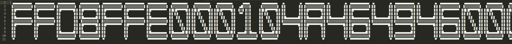
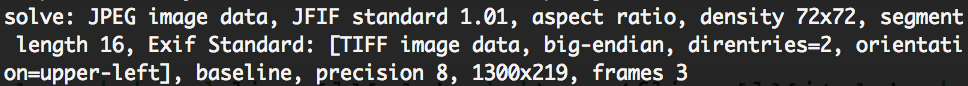

# Hackit 2016 Quals - Electronicon
### PPC - 250 pts

    EN: This task is one of the methods for the psychological attacks. It is intended for people who don't have heart diseases and reached 18 years ;)
    h4ck1t{flag.upper()}
    
[Here](pain.txt) is the text file given with the challenge. We open this file with SublimeText for example, deactivate Word Wrap and we see something like this :



At this state, we already know what we need to do : Read this text file and write it's hexadecimal content to a new file. Then we'll se what we can do with this builded file.

So to make te recognition, we first need patterns of different hexadecimal characters. So for this I created a little python code which takes an multiplier as input that we can change by hand to design which letter we are cutting out.

We must here pay attention to use codecs and utf-8 encoding to avoid problems or unwanted errors.

```python
'''
Pod for Team Fourchette Bombe
'''
import codecs
f = codecs.open('pain.txt',encoding='utf-8')
flines = f.readlines()

length = 13
multiplier = 1
offset = multiplier*length

line = ''
for i in range(0,len(flines)):
	for j in range(0,length):
		line += flines[i][j+offset];
	line += '\n'
out = codecs.open('painPatterns/out','w', encoding='utf-8')
out.write(line)
```

This code will create a file in the folder painPatters with the letter designed by the multiplier. For example here, with `multiplier = 1`, we extract letter `F` and with `multiplier = 2` we extract `D`.

To find which multiplier we need, a good and easy way is to place our cursor in one letter, check the Column number in the bottom left of Sublime Text and divide this number by the length (here 13). The integer value will be the multiplier.

Once we created all patterns with this kind of code, we can begin the character recognition. We use this little python code. 
```python
'''
Pod for Team Fourchette Bombe
'''
import codecs
f = codecs.open('pain.txt',encoding='utf-8')
flines = f.readlines()

chars = ('0','1','2','3','4','5','6','7','8','9','a','b','c','d','e','f')

solve = ''

for i in range(0,len(flines[0]),13):
	for j in range(0,len(chars)):
		fp = codecs.open('./painPatterns/'+chars[j], encoding='utf-8')
		lines = fp.readlines() 
		Found = True
		for l in range(0,11):
			newI = i
			for c in range(0,13):
				if ((flines[l][i+c] == ' ' and lines[l][c] != ' ') or (flines[l][i+c] != ' ' and lines[l][c] == ' ')):
					Found = False;
					break;

			if not Found:
				break;
		if Found:
			solve += chars[j];
			break;

endf = open('solve','w');
endf.write(solve.decode('hex'));
```

We run the python script (about 50 seconds runtime here) and then we got a new file created. A simple `file solve` in the terminal prompt will help us to know what to do next.



Luckily, the file is a jpg file. We add the extension and open it. Here we go, flag is showing !


**Flag** : h4ck1t{1_LOV3_3P1C_F0NT$}