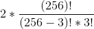

# Hackit 2016 Quals - Handmade encryption standard
### Crypto - 250 pts

    EN:
    Times are getting harder and harder for Gen.Tompson.
    I`m soldier Alderson and some time ago we got this Rijndael cipher: \xa2\xc5\xe7\xcc\xe4\xa9\xb6\x41\x0b\x77\x92\x54\x78\xdb\xed\xab\xe0\x1d\xac\x83\x2e\xe2\x6b\x43\x07\x1a\x61\xf2\x81\x0f\xfe\xc6\x6e\x36\xc5\x7b\xd6\x9c\xca\x05\x93\x76\x43\xa9\x08\x45\xa4\x8f\x88\xb9\x31\x7e\x22\x7f\x00\x00\x48\xb7\x31\x7e\x22\x7f\x00\x00
    And we have even intercepted its key(!):
    21449030350486006488383082093598
    But the problem is that decryption operation have failed somehow =(
    Our math-team found out that standart algorithm was modified by cryptographer - he decided to use his own substitution-box instead of default!
    Math team also found out that modification was pretty simple - cryptographer just exchanged 3 elements of that substitution-box between them. But which ones?..Help our math-team to find this out ;)
    P.S General Tompson can`t talk right now.

In this challenge, they talk about the Rijndael Cipher which is the algorithm used by the [AES Standard](https://fr.wikipedia.org/wiki/Advanced_Encryption_Standard). During this algorithm, a "box" of 256 bytes is used and called S-Box (For Substitution box).

After a lot of research and failed attemps, here are the elements we must know and remember before entering the channel :
- S-Box is used for encryption and S-Box-Inverse is used for decryption.
- S-Box is used for the Key Expansion part. Therefore it is used both for Encryption and Decryption.

Therefore here, as far as we need to decrypt, we'll need to change S-box aswell as S-Box-Inv accordingly.

Now few mathematics about the permutations problem. We need to switch 3 elements among them. So we first need to fetch every group of 3 distinct element between 1 and 256 without considering the place in the group. This is called a [combination](https://en.wikipedia.org/wiki/Combination).
Once we've got a group like this one : `(a,b,c)` we got only 2 permutations which changes all three elements :
- `(b,c,a)`
- `(c,a,b)`

Once we've listed this, the total of permutations equals 2 times the number of combinations of 3 among 256. Which mathematically is : ` = 5 527 040` possibilities.

So in our code, we first need to generate all this permutations with this :

```c++
const int N = 256;
const int K = 3;
std::string bitmask(K, 1); // K leading 1's
bitmask.resize(N, 0); // N-K trailing 0's
uint8_t a = 0x00, b = 0x00, c = 0x00;
do {
    bool aSet = false, bSet = false, cSet = false;
    //Here we define the three elements of the permutations 
    for (int k = 0; k < N; ++k) // [0..N-1] integers
    {
        if (bitmask[k]){
            if(!aSet){
                a = (unsigned char) k;
                aSet = true;
            }
            else if(!bSet){
                b = (unsigned char) k;
                bSet = true;
            }
            else if(!cSet){
                c = (unsigned char) k;
                cSet = true;
            }
            else{
                std::cout << "Error" << std::endl;
            }
        }
    }
} while (std::prev_permutation(bitmask.begin(), bitmask.end()));
```

We'll also need to get an aes256 implementation (The key is written in ascii. So this is 32 bytes). I used this [one](http://literatecode.com/aes256). In this file, we just need to do few changes.
We need to remove the const before the declaration of SBox and SBoxInv and then add these 2 functions :

```c++
void aes256_setInvBox(uint8_t *box){
    memcpy(sboxinv,box,256);
}
void aes256_setBox(uint8_t *box){
    memcpy(sbox,box,256);
}
```

Once we did this, we only need to change the SBox and the SBoxInv accordingly. For example, if our group is `(a,b,c)` and we want to modify it to `(b,c,a)` we have this code :

```c++
uint8_t save = 0x0;
memset(&save,newBox[a],1);

memcpy(newBox+a,newBox+b,1); //Set SBox[b] in SBox[a]
memset(newBoxinv+newBox[a],a,1); //Set SBoxInv(b) to point to the "array address" of SBox[a] which is a.
memcpy(newBox+b,newBox+c,1);
memset(newBoxinv+newBox[b],b,1);
memcpy(newBox+c,&save,1);
memset(newBoxinv+newBox[c],c,1);
```

With this, we just launch the decryption and check if we have the flag.

Final code :
```c++
/*
Pod for Team Fourchette-Bombe
*/
#include <stdlib.h>
#include <stdio.h>
#include <iostream>

#include "aes256.h"

using namespace std;

bool hasFlag(uint8_t *buf){
    std::string bufString(buf,buf+64*sizeof(uint8_t));
    if(bufString.find("h4ck1t") != std::string::npos){
        return true;
    }
    return false;
}

int main (int argc, char *argv[])
{
    aes256_context ctx;
    uint8_t key[32] = {'2', '1', '4', '4', '9', '0', '3', '0', '3', '5', '0', '4', '8', '6', '0', '0', '6', '4', '8', '8', '3', '8', '3', '0', '8', '2', '0', '9', '3', '5', '9', '8'};
    const uint8_t saveBuf[64] = {0xa2,0xc5,0xe7,0xcc,0xe4,0xa9,0xb6,0x41,0x0b,0x77,0x92,0x54,0x78,0xdb,0xed,0xab,0xe0,0x1d,0xac,0x83,0x2e,0xe2,0x6b,0x43,0x07,0x1a,0x61,0xf2,0x81,0x0f,0xfe,0xc6,0x6e,0x36,0xc5,0x7b,0xd6,0x9c,0xca,0x05,0x93,0x76,0x43,0xa9,0x08,0x45,0xa4,0x8f,0x88,0xb9,0x31,0x7e,0x22,0x7f,0x00,0x00,0x48,0xb7,0x31,0x7e,0x22,0x7f,0x00,0x00};
    uint8_t i;

    //Values to generate the permutations
    const int N = 256;
    const int K = 3;

    const uint8_t saveBox[256] =
    {
        0x63, 0x7c, 0x77, 0x7b, 0xf2, 0x6b, 0x6f, 0xc5,
        0x30, 0x01, 0x67, 0x2b, 0xfe, 0xd7, 0xab, 0x76,
        0xca, 0x82, 0xc9, 0x7d, 0xfa, 0x59, 0x47, 0xf0,
        0xad, 0xd4, 0xa2, 0xaf, 0x9c, 0xa4, 0x72, 0xc0,
        0xb7, 0xfd, 0x93, 0x26, 0x36, 0x3f, 0xf7, 0xcc,
        0x34, 0xa5, 0xe5, 0xf1, 0x71, 0xd8, 0x31, 0x15,
        0x04, 0xc7, 0x23, 0xc3, 0x18, 0x96, 0x05, 0x9a,
        0x07, 0x12, 0x80, 0xe2, 0xeb, 0x27, 0xb2, 0x75,
        0x09, 0x83, 0x2c, 0x1a, 0x1b, 0x6e, 0x5a, 0xa0,
        0x52, 0x3b, 0xd6, 0xb3, 0x29, 0xe3, 0x2f, 0x84,
        0x53, 0xd1, 0x00, 0xed, 0x20, 0xfc, 0xb1, 0x5b,
        0x6a, 0xcb, 0xbe, 0x39, 0x4a, 0x4c, 0x58, 0xcf,
        0xd0, 0xef, 0xaa, 0xfb, 0x43, 0x4d, 0x33, 0x85,
        0x45, 0xf9, 0x02, 0x7f, 0x50, 0x3c, 0x9f, 0xa8,
        0x51, 0xa3, 0x40, 0x8f, 0x92, 0x9d, 0x38, 0xf5,
        0xbc, 0xb6, 0xda, 0x21, 0x10, 0xff, 0xf3, 0xd2,
        0xcd, 0x0c, 0x13, 0xec, 0x5f, 0x97, 0x44, 0x17,
        0xc4, 0xa7, 0x7e, 0x3d, 0x64, 0x5d, 0x19, 0x73,
        0x60, 0x81, 0x4f, 0xdc, 0x22, 0x2a, 0x90, 0x88,
        0x46, 0xee, 0xb8, 0x14, 0xde, 0x5e, 0x0b, 0xdb,
        0xe0, 0x32, 0x3a, 0x0a, 0x49, 0x06, 0x24, 0x5c,
        0xc2, 0xd3, 0xac, 0x62, 0x91, 0x95, 0xe4, 0x79,
        0xe7, 0xc8, 0x37, 0x6d, 0x8d, 0xd5, 0x4e, 0xa9,
        0x6c, 0x56, 0xf4, 0xea, 0x65, 0x7a, 0xae, 0x08,
        0xba, 0x78, 0x25, 0x2e, 0x1c, 0xa6, 0xb4, 0xc6,
        0xe8, 0xdd, 0x74, 0x1f, 0x4b, 0xbd, 0x8b, 0x8a,
        0x70, 0x3e, 0xb5, 0x66, 0x48, 0x03, 0xf6, 0x0e,
        0x61, 0x35, 0x57, 0xb9, 0x86, 0xc1, 0x1d, 0x9e,
        0xe1, 0xf8, 0x98, 0x11, 0x69, 0xd9, 0x8e, 0x94,
        0x9b, 0x1e, 0x87, 0xe9, 0xce, 0x55, 0x28, 0xdf,
        0x8c, 0xa1, 0x89, 0x0d, 0xbf, 0xe6, 0x42, 0x68,
        0x41, 0x99, 0x2d, 0x0f, 0xb0, 0x54, 0xbb, 0x16
    };
    const uint8_t saveBoxInv[256] =
    {
        0x52, 0x09, 0x6a, 0xd5, 0x30, 0x36, 0xa5, 0x38,
        0xbf, 0x40, 0xa3, 0x9e, 0x81, 0xf3, 0xd7, 0xfb,
        0x7c, 0xe3, 0x39, 0x82, 0x9b, 0x2f, 0xff, 0x87,
        0x34, 0x8e, 0x43, 0x44, 0xc4, 0xde, 0xe9, 0xcb,
        0x54, 0x7b, 0x94, 0x32, 0xa6, 0xc2, 0x23, 0x3d,
        0xee, 0x4c, 0x95, 0x0b, 0x42, 0xfa, 0xc3, 0x4e,
        0x08, 0x2e, 0xa1, 0x66, 0x28, 0xd9, 0x24, 0xb2,
        0x76, 0x5b, 0xa2, 0x49, 0x6d, 0x8b, 0xd1, 0x25,
        0x72, 0xf8, 0xf6, 0x64, 0x86, 0x68, 0x98, 0x16,
        0xd4, 0xa4, 0x5c, 0xcc, 0x5d, 0x65, 0xb6, 0x92,
        0x6c, 0x70, 0x48, 0x50, 0xfd, 0xed, 0xb9, 0xda,
        0x5e, 0x15, 0x46, 0x57, 0xa7, 0x8d, 0x9d, 0x84,
        0x90, 0xd8, 0xab, 0x00, 0x8c, 0xbc, 0xd3, 0x0a,
        0xf7, 0xe4, 0x58, 0x05, 0xb8, 0xb3, 0x45, 0x06,
        0xd0, 0x2c, 0x1e, 0x8f, 0xca, 0x3f, 0x0f, 0x02,
        0xc1, 0xaf, 0xbd, 0x03, 0x01, 0x13, 0x8a, 0x6b,
        0x3a, 0x91, 0x11, 0x41, 0x4f, 0x67, 0xdc, 0xea,
        0x97, 0xf2, 0xcf, 0xce, 0xf0, 0xb4, 0xe6, 0x73,
        0x96, 0xac, 0x74, 0x22, 0xe7, 0xad, 0x35, 0x85,
        0xe2, 0xf9, 0x37, 0xe8, 0x1c, 0x75, 0xdf, 0x6e,
        0x47, 0xf1, 0x1a, 0x71, 0x1d, 0x29, 0xc5, 0x89,
        0x6f, 0xb7, 0x62, 0x0e, 0xaa, 0x18, 0xbe, 0x1b,
        0xfc, 0x56, 0x3e, 0x4b, 0xc6, 0xd2, 0x79, 0x20,
        0x9a, 0xdb, 0xc0, 0xfe, 0x78, 0xcd, 0x5a, 0xf4,
        0x1f, 0xdd, 0xa8, 0x33, 0x88, 0x07, 0xc7, 0x31,
        0xb1, 0x12, 0x10, 0x59, 0x27, 0x80, 0xec, 0x5f,
        0x60, 0x51, 0x7f, 0xa9, 0x19, 0xb5, 0x4a, 0x0d,
        0x2d, 0xe5, 0x7a, 0x9f, 0x93, 0xc9, 0x9c, 0xef,
        0xa0, 0xe0, 0x3b, 0x4d, 0xae, 0x2a, 0xf5, 0xb0,
        0xc8, 0xeb, 0xbb, 0x3c, 0x83, 0x53, 0x99, 0x61,
        0x17, 0x2b, 0x04, 0x7e, 0xba, 0x77, 0xd6, 0x26,
        0xe1, 0x69, 0x14, 0x63, 0x55, 0x21, 0x0c, 0x7d
    };

    //Round number l. Why l ? I don't know and I don't really give a shit ! :D
    int l = 0;

    //The buffer used to store the current encryption / decryption state
    uint8_t buf[65];
    //The new boxes
    uint8_t newBox[256];
    uint8_t newBoxinv[256];

    memset(buf,0x00,sizeof(buf));
    
    //Generation permutations loop
    std::string bitmask(K, 1); // K leading 1's
    bitmask.resize(N, 0); // N-K trailing 0's
    //Declare permuation values
    uint8_t a = 0x00, b = 0x00, c = 0x00;
    do {

        //Increment round and reset indexes
        l++;
        //Reset permutation values. 
        a = 0x00; b = 0x00; c = 0x00;


        //Set index to next permutation
        bool aSet = false, bSet = false, cSet = false;
        for (int k = 0; k < N; ++k) // [0..N-1] integers
        {
            if (bitmask[k]){
                if(!aSet){
                    a = (unsigned char) k;
                    aSet = true;
                }
                else if(!bSet){
                    b = (unsigned char) k;
                    bSet = true;
                }
                else if(!cSet){
                    c = (unsigned char) k;
                    cSet = true;
                }
                else{
                    std::cout << "Error" << std::endl;
                }
            }
        }

        //Reset buffer and box
        memcpy(buf,saveBuf,sizeof(buf));
        memcpy(newBox,saveBox,sizeof(saveBox));
        memcpy(newBoxinv,saveBoxInv,sizeof(saveBoxInv));

        //First permutation
        uint8_t save = 0x0;
        memset(&save,newBox[a],1);

        memcpy(newBox+a,newBox+b,1);
        memset(newBoxinv+newBox[a],a,1);
        memcpy(newBox+b,newBox+c,1);
        memset(newBoxinv+newBox[b],b,1);
        memcpy(newBox+c,&save,1);
        memset(newBoxinv+newBox[c],c,1);

        aes256_setBox(newBox);
        aes256_setInvBox(newBoxinv);

        //4 decryption because buffer is 64 bytes long
        for(int offset=0;offset<sizeof(buf);offset+=16){
            aes256_init(&ctx, key);
            aes256_decrypt_ecb(&ctx, buf+offset);
            aes256_done(&ctx);            
        }
        if(hasFlag(buf)){
            std::cout << buf << std::endl;
        }


        //2nd permutation, We reset the buffers
        memcpy(buf,saveBuf,16);
        memcpy(newBox,saveBox,256);
        memcpy(newBoxinv,saveBoxInv,256);

        //Second permutation
        memset(&save,newBox[a],1);

        memcpy(newBox+a,newBox+c,1);
        memset(newBoxinv+newBox[a],a,1);
        memcpy(newBox+c,newBox+b,1);
        memset(newBoxinv+newBox[c],c,1);
        memcpy(newBox+b,&save,1);
        memset(newBoxinv+newBox[b],b,1);

        aes256_setBox(newBox);
        aes256_setInvBox(newBoxinv);

        //4 decryption because buffer is 64 bytes long
        for(int offset=0;offset<sizeof(buf)-1;offset+=16){
            aes256_init(&ctx, key);
            aes256_decrypt_ecb(&ctx, buf+offset);
            aes256_done(&ctx);            
        }

        if(hasFlag(buf)){
            std::cout << buf << std::endl;
        }

        if(l%100000 == 0){
            std::cout << l << std::endl;
        }

    } while (std::prev_permutation(bitmask.begin(), bitmask.end()));

    return 0;
}
```
Running this programm is very quick compared to python code. It does about 20 000 permutations per second, we get the result in less than 5 minutes showing us the flag : `h4ck1t{50M30N3_KN0VV5_cRyPto_N0T_34D}` 

This program could still be improved for sure, because there's some repeating code in here :)