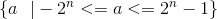
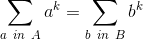

# Hitcon 2016 Quals - Beelzemon
### PPC - 150 pts

    Beelzemon gives you two integers 1 <= k <= n <= 20.
    It wants to know if you can split a set {a | -(2**n) <= a <= (2**n) - 1} into two sets A, B s.t. |A| = |B| and sum({a**k | a in A}) = sum({b**k | b in B}).
    Give Beelzemon either A or B to save your life. (separate the numbers by space)
    
This problem is pretty easy to understand. We got this set :  and we need to split it in two part of same size in order to follow the rule 

This partition problem is well known and we can find many solutions for positive sets (i.e all elements in the set are >= 0)
Therefore we take the following algorithm and will change it a bit :
```python
def find_partition(int_list):
    "returns: An attempt at a partition of `int_list` into two sets of equal sum"
    A = set()
    B = set()
    for n in sorted(int_list, reverse=True):
        if sum(A) < sum(B):
           A.add(n)
        else:
           B.add(n)
    return (A, B)
```

Here we are gonna make the split on modified sets, we elevate every element of the `int_list` to the power of k
Then, to avoid the problem of non positive elements in this algorithm we add  to every element in the `int_list`
Due to the shape of the input set (being a range of integers without missing numbers in between), making equal size sets is pretty straightforward. We just need to put the last element (which will add 0 to the sum and therefore change nothing in our partition) to the partition having the less elements to make equal size partitions.

This problem takes a certain amount of time when `(n,k)` equals `(16,16)` but nothing impossible. My algorithm gets the flag in about 9 minutes. This is a lot, and yes a C++ implementation could be faster, but that's not too much here.

Here is the final code giving us the flag we want :
```python
'''
Pod for Team Fourchette Bombe
'''
import socket
import re
import operator
import time

def find_partition(int_list,n,k):
	A = []
	B = []
	Aret = []
	Bret = []
	for i in range(0,len(int_list)):
		int_list[i] += 2**n
	
	for nb in sorted(int_list, reverse=True):
		if nb == 0:
			if len(A) < len(B):
				A.append(0)
				Aret.append(-2**n)
			else:
				B.append(0)
				Bret.append(-2**n)
		else:
			if sum(A) < sum(B):
			   A.append(nb**k)
			   Aret.append(nb-2**n)
			else:
			   B.append(nb**k)
			   Bret.append(nb-2**n)
	return (Aret, Bret)

def main():
	begin = time.time()
	s = socket.socket(socket.AF_INET, socket.SOCK_STREAM)
	s.connect(('52.198.217.117', 6666))
	while True:
		data = s.recv(2048)
		print "Received:", data
		if len(repr(data)) <=2 :
			break;
		mgex = re.search('([0-9]+) ([0-9]+)', repr(data))
		if mgex != None:
			n = long(mgex.group(1));
			k = long(mgex.group(2));
			mySet = range(-2**n,2**n);
			partition = find_partition(mySet,n,k)
			final = ''
			for p in partition[1]:
				final += ' '+str(p)
			s.send(final[1:]+'\n');
		
	print "Connection closed."
	s.close()
	print "Process duration :", time.time() - begin

main()
```

And this process gives us the flag : `hitcon{8Ee121m0n kNow3 ev1l Num8e2}`

