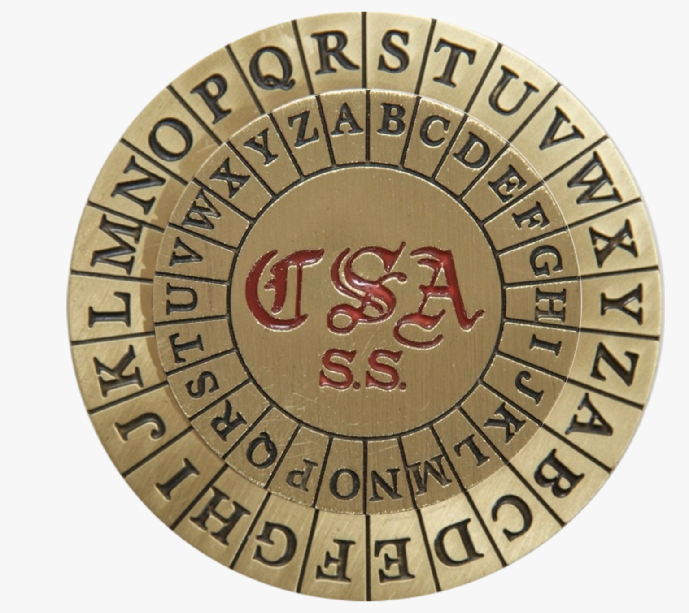
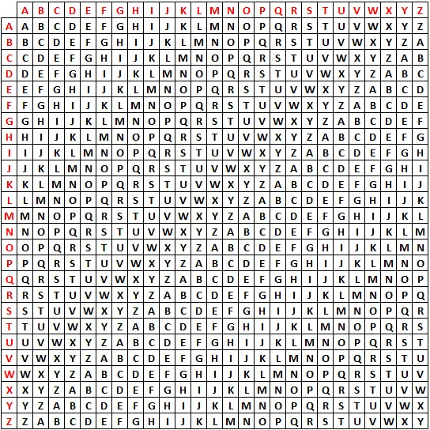

# Junior CTF 2016 - Southern Cross
### Crypto - 300 pts

[Challenge Code](https://yadi.sk/i/OwzD_MzfyKJRu)



This challenge is about the "Southern Cross Cipher". A quick look to the Southern Cross makes us think of the Vigenere Cipher.

The Vigenere cipher is based on the Ceasar Cipher. We choose a code, and then have a different ceasar cipher for each letter depending on the key. More information can be found [on the wikipedia page](https://en.wikipedia.org/wiki/Vigen%C3%A8re_cipher). Here is the Vigenere Cipher shift table :


Many different algorithms exist on Internet to solve this cipher.

I didn't code my own tool to solve this kind of cipher, but I will explain briefly the cryptanalysis to solve this.

The first goal is to find same letters group or patterns. The different offset between common words will give us hints about the key length. Once the key length is found, we have as many Ceasar Cipher as the number of letters in the key. This kind of cipher is then solved with a letter frequency analysis.

I used the famous [dcode](http://www.dcode.fr/vigenere-cipher) web tool. We ask him to entirely solve the cipher and he finds that the key should be `Bolivar`. But this tool doesn't decode the whole ciphertext and I had to use another tool to have the end of the plaintext. I used this [french web tool](https://www.apprendre-en-ligne.net/crypto/vigenere/decryptauto.html) which worked very well too. It gave me this plaintext :
```
TWENTYMILESWESTOFTUCSONTHESUNSETEXPRESSSTOPPEDATATANKTOTAKEONWATERBESIDESTHEAQUEOUSADDITIONTHEENGINEOFTHATFAMOUSFLYERACQUIREDSOMEOTHERTHINGSTHATWERENOTGOODFORITWHILETHEFIREMANWASLOWERINGTHEFEEDINGHOSEBOBTIDBALLSHARKDODSONANDAQUARTERBREDCREEKINDIANCALLEDJOHNBIGDOGCLIMBEDONTHEENGINEANDSHOWEDTHEENGINEERTHREEROUNDORIFICESINPIECESOFORDNANCETHATTHEYCARRIEDTHESEORIFICESSOIMPRESSEDTHEENGINEERWITHTHEIRPOSSIBILITIESTHATHERAISEDBOTHHANDSINAGESTURESUCHASACCOMPANIESTHEEJACULATIONDOTELLATTHECRISPCOMMANDOFSHARKDODSONWHOWASLEADEROFTHEATTACKINGFORCETHEENGINEERDESCENDEDTOTHEGROUNDANDUNCOUPLEDTHEENGINEANDTENDERTHENJOHNBIGDOGPERCHEDUPONTHECOALSPORTIVELYHELDTWOGUNSUPONTHEENGINEDRIVERANDTHEFIREMANANDSUGGESTEDTHATTHEYRUNTHEENGINEFIFTYYARDSAWAYANDTHEREAWAITFURTHERORDERSSHARKDODSONANDBOBTIDBALLSCORNINGTOPUTSUCHLOWGRADEOREASTHEPASSENGERSTHROUGHTHEMILLSTRUCKOUTFORTHERICHPOCKETOFTHEEXPRESSCARTHEYFOUNDTHEMESSENGERSERENEINTHEBELIEFTHATTHESUNSETEXPRESSWASTAKINGONNOTHINGMORESTIMULATINGANDDANGEROUSTHANAQUAPURAWHILEBOBWASKNOCKINGTHISIDEAOUTOFHISHEADWITHTHEBUTTENDOFHISSIXSHOOTERSHARKDODSONWASALREADYDOSINGTHEEXPRESSCARSAFEWITHDYNAMITETHESAFEEXPLODEDTOTHETUNEOFALLGOLDANDCURRENCYTHEPASSENGERSTHRUSTTHEIRHEADSCASUALLYOUTOFTHEWINDOWSTOLOOKFORTHETHUNDERCLOUDTHECONDUCTORJERKEDATTHEBELLROPEWHICHSAGGEDDOWNLOOSEANDUNRESISTINGATHISTUGSHARKDODSONANDBOBTIDBALLWITHTHEIRBOOTYINASTOUTCANVASBAGTUMBLEDOUTOFTHEEXPRESSCARANDRANAWKWARDLYINTHEIRHIGHHEELEDBOOTSTOTHEENGINETHEENGINEERSULLENLYANGRYBUTWISERANTHEENGINEACCORDINGTOORDERSRAPIDLYAWAYFROMTHEINERTTRAINBUTBEFORETHISWASACCOMPLISHEDTHEEXPRESSMESSENGERRECOVEREDFROMBOBTIDBALLSPERSUADERTONEUTRALITYJUMPEDOUTOFHISCARWITHAWINCHESTERRIFLEANDTOOKATRICKINTHEGAMEMRJOHNBIGDOGSITTINGONTHECOALTENDERUNWITTINGLYMADEAWRONGLEADBYGIVINGANIMITATIONOFATARGETANDTHEMESSENGERTRUMPEDHIMWITHABALLEXACTLYBETWEENHISSHOULDERBLADESTHECREEKCHEVALIEROFINDUSTRYROLLEDOFFTOTHEGROUNDTHUSINCREASINGTHESHAREOFHISCOMRADESINTHELOOTBYONESIXTHEACHTWOMILESFROMTHETANKTHEENGINEERWASORDEREDTOSTOPTHEROBBERSWAVEDADEFIANTADIEUANDPLUNGEDDOWNTHESTEEPSLOPEINTOTHETHICKWOODSTHATLINEDTHETRACKFIVEMINUTESOFCRASHINGTHROUGHATHICKETOFCHAPARRALBROUGHTTHEMTOOPENWOODSWHERETHREEHORSESWERETIEDTOLOWHANGINGBRANCHESONEWASWAITINGFORJOHNBIGDOGWHOWOULDNEVERRIDEBYNIGHTORDAYAGAINTHISANIMALTHEROBBERSDIVESTEDOFSADDLEANDBRIDLEANDSETFREETHEYMOUNTEDTHEOTHERTWOWITHTHEBAGACROSSONEPOMMELANDRODEFASTANDWITHDISCRETIONTHROUGHTHEFORESTANDUPAPRIMEVALLONELYGORGEHERETHEANIMALTHATBOREBOBTIDBALLSLIPPEDONAMOSSYBOULDERANDBROKEAFORELEGTHEYSHOTHIMTHROUGHTHEHEADATONCEANDSATDOWNTOHOLDACOUNCILOFFLIGHTMADESECUREFORTHEPRESENTBYTHETORTUOUSTRAILTHEYHADTRAVELLEDTHEQUESTIONOFTIMEWASNOLONGERSOBIGMANYMILESANDHOURSLAYBETWEENTHEMANDTHESPRYESTPOSSETHATCOULDFOLLOWSHARKDODSONSHORSEWITHTRAILINGROPEANDDROPPEDBRIDLEPANTEDANDCROPPEDTHANKFULLYOFTHEGRASSALONGTHESTREAMINTHEGORGEBOBTIDBALLOPENEDTHESACKDREWOUTDOUBLEHANDFULSOFTHENEATPACKAGESOFCURRENCYANDTHEONESACKOFGOLDANDCHUCKLEDWITHTHEGLEEOFACHILDSAYYOUOLDDOUBLEDECKEDPIRATEHECALLEDJOYFULLYTODODSONYOUSAIDWECOULDDOITYOUGOTAHEADFORFINANCINGTHATKNOCKSTHEHORNSOFFOFANYTHINGINARIZONAWHATAREWEGOINGTODOABOUTAHOSSFORYOUBOBWEAINTGOTLONGTOWAITHERETHEYLLBEONOURTRAILBEFOREDAYLIGHTINTHEMORNINOHIGUESSTHATCAYUSEOFYOURNLLCARRYDOUBLEFORAWHILEANSWEREDTHESANGUINEBOBWELLANNEXTHEFIRSTANIMALWECOMEACROSSBYJINGOESWEMADEAHAULDIDNTWEACCORDINTOTHEMARKSONTHISMONEYTHERESAPIECEITSSHORTOFWHATIEXPECTEDSAIDSHARKDODSONKICKINGSOFTLYATTHEPACKAGESWITHTHETOEOFHISBOOTANDTHENHELOOKEDPENSIVELYATTHEWETSIDESOFHISTIREDHORSEOLDBOLIVARSMIGHTYNIGHPLAYEDOUTHESAIDSLOWLYIWISHTHATSORRELOFYOURSHADNTGOTHURTSODOISAIDBOBHEARTILYBUTITCANTBEHELPEDBOLIVARSGOTPLENTYOFBOTTOMHELLGETUSBOTHFARENOUGHTOGETFRESHMOUNTSDANGITSHARKICANTHELPTHINKINHOWFUNNYITISTHATANEASTERNERLIKEYOUCANCOMEOUTHEREANDGIVEUSWESTERNFELLOWSCARDSANDSPADESINTHEDESPERADOBUSINESSWHATPARTOFTHEEASTWASYOUFROMANYWAYNEWYORKSTATESAIDSHARKDODSONSITTINGDOWNONABOULDERANDCHEWINGATWIGIWASBORNONAFARMINULSTERCOUNTYIRANAWAYFROMHOMEWHENIWASSEVENTEENITWASANACCIDENTMYCOMINGWESTIWASWALKINALONGTHEROADWITHMYCLOTHESINABUNDLEMAKINFORNEWYORKCITYIHADANIDEAOFGOINTHEREANDMAKINLOTSOFMONEYIALWAYSFELTLIKEICOULDDOITICAMETOAPLACEONEEVENINWHERETHEROADFORKEDANDIDIDNTKNOWWHICHFORKTOTAKEISTUDIEDABOUTITFORHALFANHOURANDTHENITOOKTHELEFTHANDTHATNIGHTIRUNINTOTHECAMPOFAWILDWESTSHOWTHATWASTRAVELLINAMONGTHELITTLETOWNSANDIWENTWESTWITHITIVEOFTENWONDEREDIFIWOULDNTHAVETURNEDOUTDIFFERENTIFIDTOOKTHEOTHERROADOHIRECKONYOUDHAVEENDEDUPABOUTTHESAMESAIDBOBTIDBALLCHEERFULLYPHILOSOPHICALITAINTTHEROADSWETAKEITSWHATSINSIDEOFUSTHATMAKESUSTURNOUTTHEWAYWEDOSHARKDODSONGOTUPANDLEANEDAGAINSTATREEIDAGOODDEALRATHERTHATSORRELOFYOURNHADNTHURTHIMSELFBOBHESAIDAGAINALMOSTPATHETICALLYSAMEHEREAGREEDBOBHEWASSUREAFIRSTRATEKINDOFACROWBAITBUTBOLIVARHELLPULLUSTHROUGHALLRIGHTRECKONWEDBETTERBEMOVINONHADNTWESHARKILLBAGTHISBOODLEAGINANDWELLHITTHETRAILFORHIGHERTIMBERBOBTIDBALLREPLACEDTHESPOILINTHEBAGANDTIEDTHEMOUTHOFITTIGHTLYWITHACORDWHENHELOOKEDUPTHEMOSTPROMINENTOBJECTTHATHESAWWASTHEMUZZLEOFSHARKDODSONSHELDUPONHIMWITHOUTAWAVERSTOPYOURFUNNINSAIDBOBWITHAGRINWEGOTTOBEHITTINTHEBREEZESETSTILLSAIDSHARKYOUAINTGOINTOHITNOBREEZEBOBIHATETOTELLYOUBUTTHEREAINTANYCHANCEFORBUTONEOFUSBOLIVARHESPLENTYTIREDANDHECANTCARRYDOUBLEWEBEENPARDSMEANDYOUSHARKDODSONFORTHREEYEARBOBSAIDQUIETLYWEVERISKEDOURLIVESTOGETHERTIMEANDAGAINIVEALWAYSGIVEYOUASQUAREDEALANDITHOUGHTYOUWASAMANIVEHEARDSOMEQUEERSTORIESABOUTYOUSHOOTINONEORTWOMENINAPECULIARWAYBUTINEVERBELIEVEDEMNOWIFYOUREJUSTHAVINALITTLEFUNWITHMESHARKPUTYOURGUNUPANDWELLGETONBOLIVARANDVAMOSEIFYOUMEANTOSHOOTSHOOTYOUBLACKHEARTEDSONOFATARANTULASHARKDODSONSFACEBOREADEEPLYSORROWFULLOOKYOUDONTKNOWHOWBADIFEELHESIGHEDABOUTTHATSORRELOFYOURNBREAKINHISLEGBOBTHEEXPRESSIONONDODSONSFACECHANGEDINANINSTANTTOONEOFCOLDFEROCITYMINGLEDWITHINEXORABLECUPIDITYTHESOULOFTHEMANSHOWEDITSELFFORAMOMENTLIKEANEVILFACEINTHEWINDOWOFAREPUTABLEHOUSETRULYBOBTIDBALLWASNEVERTOHITTHEBREEZEAGAINTHEDEADLYOFTHEFALSEFRIENDCRACKEDANDFILLEDTHEGORGEWITHAROARTHATTHEWALLSHURLEDBACKWITHINDIGNANTECHOESANDBOLIVARUNCONSCIOUSACCOMPLICESWIFTLYBOREAWAYTHELASTOFTHEHOLDERSUPOFTHESUNSETEXPRESSNOTPUTTOTHESTRESSOFCARRYINGDOUBLEBUTASSHARKDODSONGALLOPEDAWAYTHEWOODSSEEMEDTOFADEFROMHISVIEWTHEREVOLVERINHISRIGHTHANDTURNEDTOTHECURVEDARMOFAMAHOGANYCHAIRHISSADDLEWASSTRANGELYUPHOLSTEREDANDHEOPENEDHISEYESANDSAWHISFEETNOTINSTIRRUPSBUTRESTINGQUIETLYONTHEEDGEOFAQUARTEREDOAKDESKIAMTELLINGYOUTHATDODSONOFTHEFIRMOFDODSONDECKERWALLSTREETBROKERSOPENEDHISEYESPEABODYTHECONFIDENTIALCLERKWASSTANDINGBYHISCHAIRHESITATINGTOSPEAKTHEREWASACONFUSEDHUMOFWHEELSBELOWANDTHESEDATIVEBUZZOFANELECTRICFANAHEMPEABODYSAIDDODSONBLINKINGIMUSTHAVEFALLENASLEEPIHADAMOSTREMARKABLEDREAMWHATISITPEABODYMRWILLIAMSSIROFTRACYWILLIAMSISOUTSIDEHEHASCOMETOSETTLEHISDEALINXYZTHEMARKETCAUGHTHIMSHORTSIRIFYOUREMEMBERYESIREMEMBERWHATISXYZQUOTEDATTODAYPEABODYONEEIGHTYFIVESIRTHENTHATSHISPRICEEXCUSEMESAIDPEABODYRATHERNERVOUSLYFORSPEAKINGOFITBUTIVEBEENTALKINGTOWILLIAMSHESANOLDFRIENDOFYOURSMRDODSONANDYOUPRACTICALLYHAVEACORNERINXYZITHOUGHTYOUMIGHTTHATISITHOUGHTYOUMIGHTNOTREMEMBERTHATHESOLDYOUTHESTOCKATIFHESETTLESATTHEMARKETPRICEITWILLTAKEEVERYCENTHEHASINTHEWORLDANDHISHOMETOOTODELIVERTHESHARESTHEEXPRESSIONONDODSONSFACECHANGEDINANINSTANTTOONEOFCOLDFEROCITYMINGLEDWITHINEXORABLECUPIDITYTHESOULOFTHEMANSHOWEDITSELFFORAMOMENTLIKEANEVILFACEINTHEWINDOWOFAREPUTABLEHOUSEHEWILLSETTLEATONEEIGHTYFIVESAIDDODSONBOLIVARCANNOTCARRYDOUBLE
```

Looking at the end of the cipher, I had to guess that only the four last words were good.
The flag was `BOLIVARCANNOTCARRYDOUBLE`

_I was pretty disappointed that not flag format was given. They could easily add in the cipher text something like "THE FLAG IS" before the actual Flag to help people know instead of maybe bruteforcing the scoreboard, which, luckily I didn't have to do._