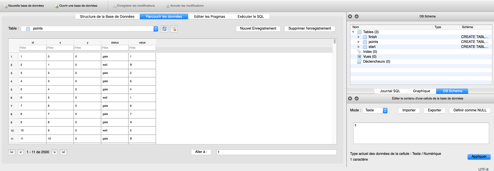
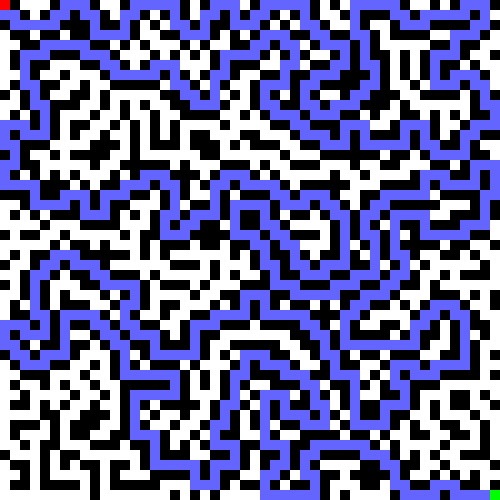

# Qiwi-Infosec CTF 2016 - PPC 400
### PPC - 400 pts

Data given here is the [maze.dv](maze.db) file.

A quick look with DB Browser for SQLite show us the goal. We got 2500 points with different values. We start from `(0,0)` and need to go to `(49,49)`.


I decided to use an A* algorithm python implementation done by Christian Careaga (christian.careaga7@gmail.com).

The code then is pretty straightforward. We create our maze, find the path, and then concatenate each point value in the path.

```python
#################################
# Pod for Team Fourchette Bombe #
#################################

import sqlite3
from PIL import Image
from mazeastar import astar
import numpy

conn = sqlite3.connect("maze.db")
c = conn.cursor()
w, h = 50,50
size = 10
MatrixGate = [[0 for x in range(w)] for y in range(h)]
MatrixValue = [[0 for x in range(w)] for y in range(h)]
for row in c.execute('SELECT * FROM points'):
	if row[3] == 'gate':
		MatrixGate[row[1]][row[2]] = 0
	else:
		MatrixGate[row[1]][row[2]] = 1
	MatrixValue[row[1]][row[2]] = row[4]

im = Image.new('RGB',(w*size,h*size),"black")
pixels = im.load()
for x in range(0,w):
	string = ""
	for y in range(0,h):
		if MatrixGate[x][y] == 0:
			for i in range(0,size):
				for j in range (0,size):
					pixels[size*x+i,size*y+j] = (255,255,255)

customArray = []
for i in range(0,50):
	customArray.append(MatrixGate[i])

nmap = numpy.array(customArray)
    
sol = astar(nmap, (0,0), (49,49))+[(0, 0)]

string = ""
for x in sol[::-1]:
	for i in range(0,size):
		for j in range (0,size):
			pixels[x[0]*size+i,x[1]*size+j] = (100,100,255)
	string += MatrixValue[x[0]][x[1]]

for i in range(0,size):
	for j in range (0,size):
		pixels[0+i,0+j] = (255,0,0)
		pixels[size*49+i,size*49+j] = (0,255,0)

im.show()
print string
```

This code will print the resulting string and show a nice image of the solution


The resulting string :
```
154C82F36487A9157315AADFDDED1BB83ECD98E49EADAFEB03DB563A94E0851478C408CFD6B0BB42B030F61A82E655B7FCA0E1FA68DF676758DC60FBFD1016F0EB8E7A2B5170A157497EF711E4009653BC9B20726C98B6561EFBE316AC2AB2DCBE56494F05B44ED3EB62DA4109BEEC2537266FEDE44ACB12A17CA8C8A5BA9E1A4D24ACAD900FFBD228AC187B9024BEDC941D137EA3A92F9F8506740CD8C62DBEDB9990F3E0259434D9FCF070FEC9E60C5697BABA83A4E59EB4C3F0E7AFD44B1B8D9D93933962B27237560B5F8F7D19904D790842FA596FBB52B2A3F7EE15B7F589D28A6F20F747615E7ED135E17AFE8FE073B6606F5C893D40CB78B635AA5FE4E0EE10C572D5E7AECEAF743953D05F78BBC10A9BB3D53B0011AE5F269C806E5F9E6026C954A0CDF9C797953360602B96FC06324C3160701505C24597F6F7C77D5B76CBE25CD2B706A41DA324A1B79CFC4BA8B11F800593514D27754
```
has no particular signification. I was a bit disapointed that this string wasn't a text, or a png image, or anything else. This PPC was considered as the hardest of the CTF but this string is the actual Flag...